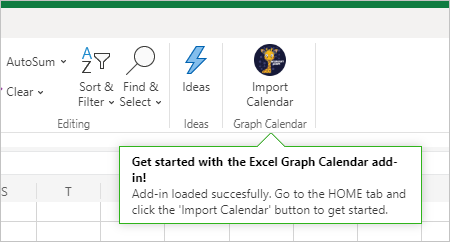

<!-- markdownlint-disable MD002 MD041 -->

Neste exercício, você criará uma solução de add-in do Office usando [Express](http://expressjs.com/). A solução consistirá em duas partes.

- O complemento, implementado como arquivos HTML e JavaScript estáticos.
- Um Node.js/Express que atende ao add-in e implementa uma API da Web para recuperar dados do add-in.

## <a name="create-the-server"></a>Criar o servidor

1. Abra sua interface de linha de comando (CLI), navegue até um diretório onde você deseja criar seu projeto e execute o seguinte comando para gerar um arquivo package.json.

    ```Shell
    yarn init
    ```

    Insira valores para os prompts conforme apropriado. Se você não tiver certeza, os valores padrão serão bons.

1. Execute os seguintes comandos para instalar dependências.

    ```Shell
    yarn add express@4.17.1 express-promise-router@4.1.0 dotenv@8.2.0 node-fetch@2.6.1 jsonwebtoken@8.5.1@
    yarn add jwks-rsa@2.0.2 @azure/msal-node@1.0.2 @microsoft/microsoft-graph-client@2.2.1
    yarn add date-fns@2.21.1 date-fns-tz@1.1.4 isomorphic-fetch@3.0.0 windows-iana@5.0.1
    yarn add -D typescript@4.2.4 ts-node@9.1.1 nodemon@2.0.7 @types/node@14.14.41 @types/express@4.17.11
    yarn add -D @types/node-fetch@2.5.10 @types/jsonwebtoken@8.5.1 @types/microsoft-graph@1.35.0
    yarn add -D @types/office-js@1.0.174 @types/jquery@3.5.5 @types/isomorphic-fetch@0.0.35
    ```

1. Execute o seguinte comando para gerar um tsconfig.jsno arquivo.

    ```Shell
    tsc --init
    ```

1. Abra **./tsconfig.jsem** um editor de texto e faça as seguintes alterações.

    - Altere `target` o valor para `es6` .
    - Descomungar `outDir` o valor e defini-lo como `./dist` .
    - Descomungar `rootDir` o valor e defini-lo como `./src` .

1. Abra **./package.jse** adicione a seguinte propriedade ao JSON.

    ```json
    "scripts": {
      "start": "nodemon ./src/server.ts",
      "build": "tsc --project ./"
    },
    ```

1. Execute o seguinte comando para gerar e instalar certificados de desenvolvimento para o seu complemento.

    ```Shell
    npx office-addin-dev-certs install
    ```

    Se solicitado a confirmar, confirme as ações. Depois que o comando é concluído, você verá uma saída semelhante à seguinte.

    ```Shell
    You now have trusted access to https://localhost.
    Certificate: <path>\localhost.crt
    Key: <path>\localhost.key
    ```

1. Crie um novo arquivo chamado **.env** na raiz do seu projeto e adicione o código a seguir.

    :::code language="ini" source="../demo/graph-tutorial/example.env":::

    Substitua pelo caminho para localhost.crt e pelo caminho `PATH_TO_LOCALHOST.CRT` `PATH_TO_LOCALHOST.KEY` para localhost.key saída pelo comando anterior.

1. Crie um novo diretório na raiz do seu projeto chamado **src**.

1. Crie dois diretórios no **diretório ./src:** **addin** e **api**.

1. Crie um novo arquivo chamado **auth.ts** no **diretório ./src/api** e adicione o código a seguir.

    ```typescript
    import Router from 'express-promise-router';

    const authRouter = Router();

    // TODO: Implement this router

    export default authRouter;
    ```

1. Crie um novo arquivo chamado **graph.ts** no **diretório ./src/api** e adicione o código a seguir.

    ```typescript
    import Router from 'express-promise-router';

    const graphRouter = Router();

    // TODO: Implement this router

    export default graphRouter;
    ```

1. Crie um novo arquivo chamado **server.ts** no diretório **./src** e adicione o código a seguir.

    :::code language="typescript" source="../demo/graph-tutorial/src/server.ts" id="ServerSnippet":::

## <a name="create-the-add-in"></a>Criar o suplemento

1. Crie um novo arquivo **chamadotaskpane.html** no diretório **./src/addin** e adicione o código a seguir.

    :::code language="html" source="../demo/graph-tutorial/src/addin/taskpane.html" id="TaskPaneHtmlSnippet":::

1. Crie um novo arquivo chamado **taskpane.css** no diretório **./src/addin** e adicione o código a seguir.

    :::code language="css" source="../demo/graph-tutorial/src/addin/taskpane.css":::

1. Crie um novo arquivo chamado **taskpane.js** no diretório **./src/addin** e adicione o código a seguir.

    ```javascript
    // TEMPORARY CODE TO VERIFY ADD-IN LOADS
    'use strict';

    Office.onReady(info => {
      if (info.host === Office.HostType.Excel) {
        $(function() {
          $('p').text('Hello World!!');
        });
      }
    });
    ```

1. Crie um novo diretório no **diretório .src/addin** chamado **assets**.

1. Adicione três arquivos PNG neste diretório de acordo com a tabela a seguir.

    | Nome do arquivo   | Tamanho em pixels |
    |-------------|----------------|
    | icon-80.png | 80x80          |
    | icon-32.png | 32x32          |
    | icon-16.png | 16 x 16          |

    > [!NOTE]
    > Você pode usar qualquer imagem que quiser para esta etapa. Você também pode baixar as imagens usadas neste exemplo diretamente do [GitHub](https://github.com/microsoftgraph/msgraph-training-office-addin/demo/graph-tutorial/src/addin/assets).

1. Crie um novo diretório na raiz do projeto chamado **manifesto**.

1. Crie um novo arquivo chamado **manifest.xml** na pasta **./manifest** e adicione o código a seguir. Substitua `NEW_GUID_HERE` por um novo GUID, como `b4fa03b8-1eb6-4e8b-a380-e0476be9e019` .

    :::code language="xml" source="../demo/graph-tutorial/manifest/manifest.xml":::

## <a name="side-load-the-add-in-in-excel"></a>Carregar lado a lado o complemento no Excel

1. Inicie o servidor executando o seguinte comando.

    ```Shell
    yarn start
    ```

1. Abra seu navegador e navegue até `https://localhost:3000/taskpane.html` . Você deve ver uma `Not loaded` mensagem.

1. No navegador, vá [para](https://www.office.com/) Office.com e entre. Selecione **Criar** na barra de ferramentas à esquerda e selecione **Planilha**.

    

1. Selecione a **guia** Inserir e selecione **Office Add-ins**.

1. Selecione **Carregar Meu Complemento** e, em seguida, selecione **Procurar**. Carregue seu **arquivo ./manifest/manifest.xml.**

1. Selecione o **botão Importar Calendário** na guia **Início** para abrir o taskpane.

    

1. Depois que o taskpane abrir, você deverá ver uma `Hello World!` mensagem.

    
