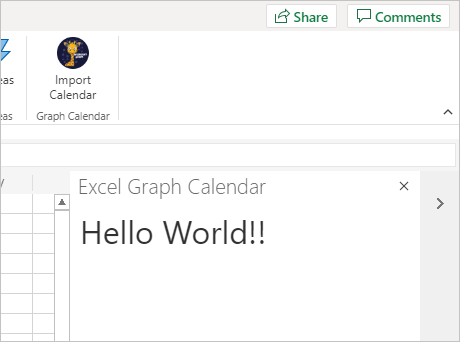

<!-- markdownlint-disable MD002 MD041 -->

<span data-ttu-id="cd028-101">Neste exercício, você criará uma solução de add-in do Office usando [Express](http://expressjs.com/).</span><span class="sxs-lookup"><span data-stu-id="cd028-101">In this exercise you will create an Office Add-in solution using [Express](http://expressjs.com/).</span></span> <span data-ttu-id="cd028-102">A solução consistirá em duas partes.</span><span class="sxs-lookup"><span data-stu-id="cd028-102">The solution will consist of two parts.</span></span>

- <span data-ttu-id="cd028-103">O complemento, implementado como arquivos HTML e JavaScript estáticos.</span><span class="sxs-lookup"><span data-stu-id="cd028-103">The add-in, implemented as static HTML and JavaScript files.</span></span>
- <span data-ttu-id="cd028-104">Um Node.js/Express que atende ao add-in e implementa uma API da Web para recuperar dados do add-in.</span><span class="sxs-lookup"><span data-stu-id="cd028-104">A Node.js/Express server that serves the add-in and implements a web API to retrieve data for the add-in.</span></span>

## <a name="create-the-server"></a><span data-ttu-id="cd028-105">Criar o servidor</span><span class="sxs-lookup"><span data-stu-id="cd028-105">Create the server</span></span>

1. <span data-ttu-id="cd028-106">Abra sua interface de linha de comando (CLI), navegue até um diretório onde você deseja criar seu projeto e execute o seguinte comando para gerar um arquivo package.json.</span><span class="sxs-lookup"><span data-stu-id="cd028-106">Open your command-line interface (CLI), navigate to a directory where you want to create your project, and run the following command to generate a package.json file.</span></span>

    ```Shell
    yarn init
    ```

    <span data-ttu-id="cd028-107">Insira valores para os prompts conforme apropriado.</span><span class="sxs-lookup"><span data-stu-id="cd028-107">Enter values for the prompts as appropriate.</span></span> <span data-ttu-id="cd028-108">Se você não tiver certeza, os valores padrão serão bons.</span><span class="sxs-lookup"><span data-stu-id="cd028-108">If you're unsure, the default values are fine.</span></span>

1. <span data-ttu-id="cd028-109">Execute os seguintes comandos para instalar dependências.</span><span class="sxs-lookup"><span data-stu-id="cd028-109">Run the following commands to install dependencies.</span></span>

    ```Shell
    yarn add express@4.17.1 express-promise-router@4.1.0 dotenv@8.2.0 node-fetch@2.6.1 jsonwebtoken@8.5.1@
    yarn add jwks-rsa@2.0.2 @azure/msal-node@1.0.2 @microsoft/microsoft-graph-client@2.2.1
    yarn add date-fns@2.21.1 date-fns-tz@1.1.4 isomorphic-fetch@3.0.0 windows-iana@5.0.1
    yarn add -D typescript@4.2.4 ts-node@9.1.1 nodemon@2.0.7 @types/node@14.14.41 @types/express@4.17.11
    yarn add -D @types/node-fetch@2.5.10 @types/jsonwebtoken@8.5.1 @types/microsoft-graph@1.35.0
    yarn add -D @types/office-js@1.0.174 @types/jquery@3.5.5 @types/isomorphic-fetch@0.0.35
    ```

1. <span data-ttu-id="cd028-110">Execute o seguinte comando para gerar um tsconfig.jsno arquivo.</span><span class="sxs-lookup"><span data-stu-id="cd028-110">Run the following command to generate a tsconfig.json file.</span></span>

    ```Shell
    tsc --init
    ```

1. <span data-ttu-id="cd028-111">Abra **./tsconfig.jsem** um editor de texto e faça as seguintes alterações.</span><span class="sxs-lookup"><span data-stu-id="cd028-111">Open **./tsconfig.json** in a text editor and make the following changes.</span></span>

    - <span data-ttu-id="cd028-112">Altere `target` o valor para `es6` .</span><span class="sxs-lookup"><span data-stu-id="cd028-112">Change the `target` value to `es6`.</span></span>
    - <span data-ttu-id="cd028-113">Descomungar `outDir` o valor e defini-lo como `./dist` .</span><span class="sxs-lookup"><span data-stu-id="cd028-113">Uncomment the `outDir` value and set it to `./dist`.</span></span>
    - <span data-ttu-id="cd028-114">Descomungar `rootDir` o valor e defini-lo como `./src` .</span><span class="sxs-lookup"><span data-stu-id="cd028-114">Uncomment the `rootDir` value and set it to `./src`.</span></span>

1. <span data-ttu-id="cd028-115">Abra **./package.jse** adicione a seguinte propriedade ao JSON.</span><span class="sxs-lookup"><span data-stu-id="cd028-115">Open **./package.json** and add the following property to the JSON.</span></span>

    ```json
    "scripts": {
      "start": "nodemon ./src/server.ts",
      "build": "tsc --project ./"
    },
    ```

1. <span data-ttu-id="cd028-116">Execute o seguinte comando para gerar e instalar certificados de desenvolvimento para o seu complemento.</span><span class="sxs-lookup"><span data-stu-id="cd028-116">Run the following command to generate and install development certificates for your add-in.</span></span>

    ```Shell
    npx office-addin-dev-certs install
    ```

    <span data-ttu-id="cd028-117">Se solicitado a confirmar, confirme as ações.</span><span class="sxs-lookup"><span data-stu-id="cd028-117">If prompted for confirmation, confirm the actions.</span></span> <span data-ttu-id="cd028-118">Depois que o comando é concluído, você verá uma saída semelhante à seguinte.</span><span class="sxs-lookup"><span data-stu-id="cd028-118">Once the command completes, you will see output similar to the following.</span></span>

    ```Shell
    You now have trusted access to https://localhost.
    Certificate: <path>\localhost.crt
    Key: <path>\localhost.key
    ```

1. <span data-ttu-id="cd028-119">Crie um novo arquivo chamado **.env** na raiz do seu projeto e adicione o código a seguir.</span><span class="sxs-lookup"><span data-stu-id="cd028-119">Create a new file named **.env** in the root of your project and add the following code.</span></span>

    :::code language="ini" source="../demo/graph-tutorial/example.env":::

    <span data-ttu-id="cd028-120">Substitua pelo caminho para localhost.crt e pelo caminho `PATH_TO_LOCALHOST.CRT` `PATH_TO_LOCALHOST.KEY` para localhost.key saída pelo comando anterior.</span><span class="sxs-lookup"><span data-stu-id="cd028-120">Replace `PATH_TO_LOCALHOST.CRT` with the path to localhost.crt and `PATH_TO_LOCALHOST.KEY` with the path to localhost.key output by the previous command.</span></span>

1. <span data-ttu-id="cd028-121">Crie um novo diretório na raiz do seu projeto chamado **src**.</span><span class="sxs-lookup"><span data-stu-id="cd028-121">Create a new directory in the root of your project named **src**.</span></span>

1. <span data-ttu-id="cd028-122">Crie dois diretórios no **diretório ./src:** **addin** e **api**.</span><span class="sxs-lookup"><span data-stu-id="cd028-122">Create two directories in the **./src** directory: **addin** and **api**.</span></span>

1. <span data-ttu-id="cd028-123">Crie um novo arquivo chamado **auth.ts** no **diretório ./src/api** e adicione o código a seguir.</span><span class="sxs-lookup"><span data-stu-id="cd028-123">Create a new file named **auth.ts** in the **./src/api** directory and add the following code.</span></span>

    ```typescript
    import Router from 'express-promise-router';

    const authRouter = Router();

    // TODO: Implement this router

    export default authRouter;
    ```

1. <span data-ttu-id="cd028-124">Crie um novo arquivo chamado **graph.ts** no **diretório ./src/api** e adicione o código a seguir.</span><span class="sxs-lookup"><span data-stu-id="cd028-124">Create a new file named **graph.ts** in the **./src/api** directory and add the following code.</span></span>

    ```typescript
    import Router from 'express-promise-router';

    const graphRouter = Router();

    // TODO: Implement this router

    export default graphRouter;
    ```

1. <span data-ttu-id="cd028-125">Crie um novo arquivo chamado **server.ts** no diretório **./src** e adicione o código a seguir.</span><span class="sxs-lookup"><span data-stu-id="cd028-125">Create a new file named **server.ts** in the **./src** directory and add the following code.</span></span>

    :::code language="typescript" source="../demo/graph-tutorial/src/server.ts" id="ServerSnippet":::

## <a name="create-the-add-in"></a><span data-ttu-id="cd028-126">Criar o suplemento</span><span class="sxs-lookup"><span data-stu-id="cd028-126">Create the add-in</span></span>

1. <span data-ttu-id="cd028-127">Crie um novo arquivo **chamadotaskpane.html** no diretório **./src/addin** e adicione o código a seguir.</span><span class="sxs-lookup"><span data-stu-id="cd028-127">Create a new file named **taskpane.html** in the **./src/addin** directory and add the following code.</span></span>

    :::code language="html" source="../demo/graph-tutorial/src/addin/taskpane.html" id="TaskPaneHtmlSnippet":::

1. <span data-ttu-id="cd028-128">Crie um novo arquivo chamado **taskpane.css** no diretório **./src/addin** e adicione o código a seguir.</span><span class="sxs-lookup"><span data-stu-id="cd028-128">Create a new file named **taskpane.css** in the **./src/addin** directory and add the following code.</span></span>

    :::code language="css" source="../demo/graph-tutorial/src/addin/taskpane.css":::

1. <span data-ttu-id="cd028-129">Crie um novo arquivo chamado **taskpane.js** no diretório **./src/addin** e adicione o código a seguir.</span><span class="sxs-lookup"><span data-stu-id="cd028-129">Create a new file named **taskpane.js** in the **./src/addin** directory and add the following code.</span></span>

    ```javascript
    // TEMPORARY CODE TO VERIFY ADD-IN LOADS
    'use strict';

    Office.onReady(info => {
      if (info.host === Office.HostType.Excel) {
        $(function() {
          $('p').text('Hello World!!');
        });
      }
    });
    ```

1. <span data-ttu-id="cd028-130">Crie um novo diretório no **diretório .src/addin** chamado **assets**.</span><span class="sxs-lookup"><span data-stu-id="cd028-130">Create a new directory in the **.src/addin** directory named **assets**.</span></span>

1. <span data-ttu-id="cd028-131">Adicione três arquivos PNG neste diretório de acordo com a tabela a seguir.</span><span class="sxs-lookup"><span data-stu-id="cd028-131">Add three PNG files in this directory according to the following table.</span></span>

    | <span data-ttu-id="cd028-132">Nome do arquivo</span><span class="sxs-lookup"><span data-stu-id="cd028-132">File name</span></span>   | <span data-ttu-id="cd028-133">Tamanho em pixels</span><span class="sxs-lookup"><span data-stu-id="cd028-133">Size in pixels</span></span> |
    |-------------|----------------|
    | <span data-ttu-id="cd028-134">icon-80.png</span><span class="sxs-lookup"><span data-stu-id="cd028-134">icon-80.png</span></span> | <span data-ttu-id="cd028-135">80x80</span><span class="sxs-lookup"><span data-stu-id="cd028-135">80x80</span></span>          |
    | <span data-ttu-id="cd028-136">icon-32.png</span><span class="sxs-lookup"><span data-stu-id="cd028-136">icon-32.png</span></span> | <span data-ttu-id="cd028-137">32x32</span><span class="sxs-lookup"><span data-stu-id="cd028-137">32x32</span></span>          |
    | <span data-ttu-id="cd028-138">icon-16.png</span><span class="sxs-lookup"><span data-stu-id="cd028-138">icon-16.png</span></span> | <span data-ttu-id="cd028-139">16 x 16</span><span class="sxs-lookup"><span data-stu-id="cd028-139">16x16</span></span>          |

    > [!NOTE]
    > <span data-ttu-id="cd028-140">Você pode usar qualquer imagem que quiser para esta etapa.</span><span class="sxs-lookup"><span data-stu-id="cd028-140">You can use any image you want for this step.</span></span> <span data-ttu-id="cd028-141">Você também pode baixar as imagens usadas neste exemplo diretamente do [GitHub](https://github.com/microsoftgraph/msgraph-training-office-addin/demo/graph-tutorial/src/addin/assets).</span><span class="sxs-lookup"><span data-stu-id="cd028-141">You can also download the images used in this sample directly from [GitHub](https://github.com/microsoftgraph/msgraph-training-office-addin/demo/graph-tutorial/src/addin/assets).</span></span>

1. <span data-ttu-id="cd028-142">Crie um novo diretório na raiz do projeto chamado **manifesto**.</span><span class="sxs-lookup"><span data-stu-id="cd028-142">Create a new directory in the root of the project named **manifest**.</span></span>

1. <span data-ttu-id="cd028-143">Crie um novo arquivo chamado **manifest.xml** na pasta **./manifest** e adicione o código a seguir.</span><span class="sxs-lookup"><span data-stu-id="cd028-143">Create a new file named **manifest.xml** in the **./manifest** folder and add the following code.</span></span> <span data-ttu-id="cd028-144">Substitua `NEW_GUID_HERE` por um novo GUID, como `b4fa03b8-1eb6-4e8b-a380-e0476be9e019` .</span><span class="sxs-lookup"><span data-stu-id="cd028-144">Replace `NEW_GUID_HERE` with a new GUID, like `b4fa03b8-1eb6-4e8b-a380-e0476be9e019`.</span></span>

    :::code language="xml" source="../demo/graph-tutorial/manifest/manifest.xml":::

## <a name="side-load-the-add-in-in-excel"></a><span data-ttu-id="cd028-145">Carregar lado a lado o complemento no Excel</span><span class="sxs-lookup"><span data-stu-id="cd028-145">Side-load the add-in in Excel</span></span>

1. <span data-ttu-id="cd028-146">Inicie o servidor executando o seguinte comando.</span><span class="sxs-lookup"><span data-stu-id="cd028-146">Start the server by running the following command.</span></span>

    ```Shell
    yarn start
    ```

1. <span data-ttu-id="cd028-147">Abra seu navegador e navegue até `https://localhost:3000/taskpane.html` .</span><span class="sxs-lookup"><span data-stu-id="cd028-147">Open your browser and browse to `https://localhost:3000/taskpane.html`.</span></span> <span data-ttu-id="cd028-148">Você deve ver uma `Not loaded` mensagem.</span><span class="sxs-lookup"><span data-stu-id="cd028-148">You should see a `Not loaded` message.</span></span>

1. <span data-ttu-id="cd028-149">No navegador, vá [para](https://www.office.com/) Office.com e entre.</span><span class="sxs-lookup"><span data-stu-id="cd028-149">In your browser, go to [Office.com](https://www.office.com/) and sign in.</span></span> <span data-ttu-id="cd028-150">Selecione **Criar** na barra de ferramentas à esquerda e selecione **Planilha**.</span><span class="sxs-lookup"><span data-stu-id="cd028-150">Select **Create** in the left-hand toolbar, then select **Spreadsheet**.</span></span>

    

1. <span data-ttu-id="cd028-152">Selecione a **guia** Inserir e selecione **Office Add-ins**.</span><span class="sxs-lookup"><span data-stu-id="cd028-152">Select the **Insert** tab, then select **Office Add-ins**.</span></span>

1. <span data-ttu-id="cd028-153">Selecione **Carregar Meu Complemento** e, em seguida, selecione **Procurar**.</span><span class="sxs-lookup"><span data-stu-id="cd028-153">Select **Upload My Add-in**, then select **Browse**.</span></span> <span data-ttu-id="cd028-154">Carregue seu **arquivo ./manifest/manifest.xml.**</span><span class="sxs-lookup"><span data-stu-id="cd028-154">Upload your **./manifest/manifest.xml** file.</span></span>

1. <span data-ttu-id="cd028-155">Selecione o **botão Importar Calendário** na guia **Início** para abrir o taskpane.</span><span class="sxs-lookup"><span data-stu-id="cd028-155">Select the **Import Calendar** button on the **Home** tab to open the taskpane.</span></span>

    

1. <span data-ttu-id="cd028-157">Depois que o taskpane abrir, você deverá ver uma `Hello World!` mensagem.</span><span class="sxs-lookup"><span data-stu-id="cd028-157">After the taskpane opens, you should see a `Hello World!` message.</span></span>

    
