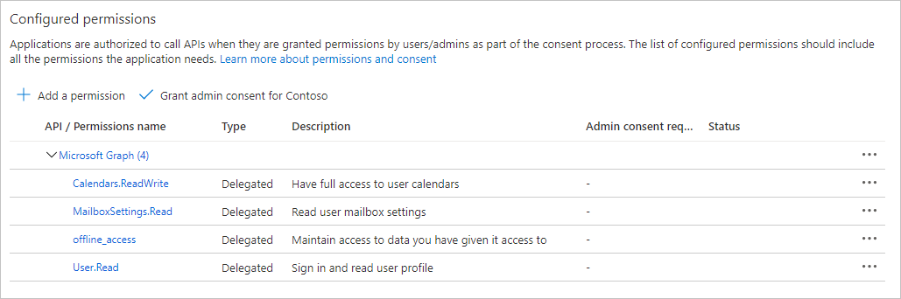

<!-- markdownlint-disable MD002 MD041 -->

Neste exercício, você criará um novo registro de aplicativo Web do Azure AD usando o Centro de administração do Azure Active Directory.

1. Abra um navegador e navegue até o [centro de administração do Azure Active Directory](https://aad.portal.azure.com). Faça logon usando uma **conta pessoal** (também conhecida como Conta da Microsoft) ou **Conta Corporativa ou de Estudante**.

1. Selecione **Azure Active Directory** na navegação esquerda e selecione **Registros de aplicativos** em **Gerenciar**.

    

1. Selecione **Novo registro**. Na página **Registrar um aplicativo**, defina os valores da seguinte forma.

    - Defina **Nome** para `Office Add-in Graph Tutorial`.
    - Defina **Tipos de conta com suporte** para **Contas em qualquer diretório organizacional e contas pessoais da Microsoft**.
    - Em **URI de Redirecionamento**, defina o primeiro menu suspenso para `Single-page application (SPA)` e defina o valor como `https://localhost:3000/consent.html`.

    

1. Selecione **Registrar**. Na página Tutorial do Gráfico de Complementos do **Office,** copie o valor da ID do Aplicativo **(cliente)** e salve-a, você precisará dele na próxima etapa.

    

1. Selecione **Autenticação** em **Gerenciar**. Localize **a seção Concessão Implícita** e habilita **tokens de Acesso** e **tokens de ID**. Selecione **Salvar**.

    

1. Selecione **Certificados e segredos** sob **Gerenciar**. Selecione o botão **Novo segredo do cliente**. Insira um valor em **Descrição** e selecione uma das opções para **Expira** em e selecione **Adicionar**.

1. Copie o valor secreto do cliente antes de sair desta página. Você precisará dele na próxima etapa.

    > [!IMPORTANT]
    > Este segredo do cliente nunca é mostrado novamente, portanto, copie-o agora.

1. Selecione **permissões de API** em **Gerenciar**, em seguida, selecione Adicionar **uma permissão**.

1. Selecione **Microsoft Graph**, em **seguida, Permissões delegadas**.

1. Selecione as seguintes permissões e selecione **Adicionar permissões**.

    - **offline_access** - isso permitirá que o aplicativo atualize tokens de acesso quando eles expirarem.
    - **Calendars.ReadWrite** - isso permitirá que o aplicativo leia e escreva no calendário do usuário.
    - **MailboxSettings.Read** - isso permitirá que o aplicativo receba o fuso horário do usuário a partir de suas configurações de caixa de correio.

    

## Configurar o login único do Office Add-in

Nesta seção, você atualizará o registro do aplicativo para dar suporte ao [SSO (SSO)](https://docs.microsoft.com/office/dev/add-ins/develop/sso-in-office-add-ins).

1. Selecione **Expor uma API**. Na seção **Escopos definidos por esta API,** selecione **Adicionar um escopo**. Quando solicitado a definir um **URI de ID** do aplicativo, de definir o valor como `api://localhost:3000/YOUR_APP_ID_HERE` , `YOUR_APP_ID_HERE` substituindo pela ID do aplicativo. Escolha **Salvar e continuar**.

1. Preencha os campos da seguinte forma e selecione **Adicionar escopo**.

    - **Nome do escopo:**`access_as_user`
    - **Quem pode consentir?: Administradores e usuários**
    - **Nome de exibição de consentimento do administrador:**`Access the app as the user`
    - **Descrição do consentimento do administrador:**`Allows Office Add-ins to call the app's web APIs as the current user.`
    - **Nome de exibição de consentimento do usuário:**`Access the app as you`
    - **Descrição do consentimento do usuário:**`Allows Office Add-ins to call the app's web APIs as you.`
    - **Estado: Habilitado**

    

1. Na seção **Aplicativos cliente autorizados,** selecione **Adicionar um aplicativo cliente**. Insira uma ID do cliente na lista a seguir, habilita o escopo em **Escopos Autorizados** e selecione **Adicionar aplicativo**. Repita esse processo para cada uma das IDs do cliente na lista.

    - `d3590ed6-52b3-4102-aeff-aad2292ab01c` (Microsoft Office)
    - `ea5a67f6-b6f3-4338-b240-c655ddc3cc8e` (Microsoft Office)
    - `57fb890c-0dab-4253-a5e0-7188c88b2bb4`(Office na Web)
    - `08e18876-6177-487e-b8b5-cf950c1e598c`(Office na Web)
