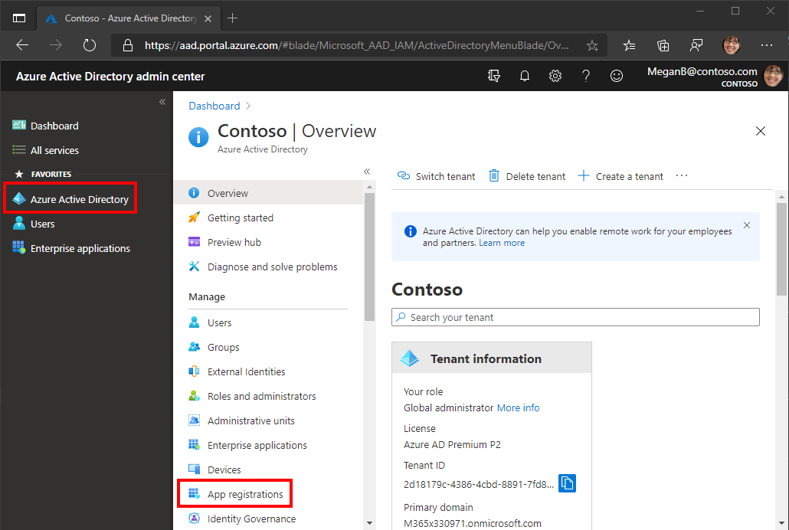

<!-- markdownlint-disable MD002 MD041 -->

Neste exercício, você criará um novo registro de aplicativo Web do Azure AD usando o Centro de administração do Azure Active Directory.In this exercise, you will create a new Azure AD web application registration using the Azure Active Directory admin center.

1. Abra um navegador e navegue até o [centro de administração do Azure Active Directory](https://aad.portal.azure.com).Open a browser and navigate to the [Azure Active Directory admin center](https://aad.portal.azure.com). Faça logon usando uma **conta pessoal** (também conhecida como Conta da Microsoft) ou **Conta Corporativa ou de Estudante**.Login using a **personal account** (aka: Microsoft Account) or **Work or School Account**.

1. Selecione **Azure Active Directory** na navegação esquerda e selecione **Registros de aplicativos** em **Gerenciar**.Select **Azure Active Directory** in the left-hand navigation, then select **App registrations** under **Manage**.

    

1. Selecione **Novo registro**.Select **New registration**. Na página **Registrar um aplicativo**, defina os valores da seguinte forma.On the **Register an application** page, set the values as follows.

    - Defina **Nome** para `Office Add-in Graph Tutorial`.Set **Name** to `Office Add-in Graph Tutorial`.
    - Defina **Tipos de conta com suporte** para **Contas em qualquer diretório organizacional e contas pessoais da Microsoft**.Set **Supported account types** to **Accounts in any organizational directory and personal Microsoft accounts**.
    - Em **URI de Redirecionamento**, defina o primeiro menu suspenso para `Single-page application (SPA)` e defina o valor como `https://localhost:3000/consent.html`.Under **Redirect URI**, set the first drop-down to `Single-page application (SPA)` and set the value to `https://localhost:3000/consent.html`.

    

1. Selecione **Registrar**.Select **Register**. Na página Tutorial do Gráfico de Complementos do **Office,** copie o valor da ID do Aplicativo **(cliente)** e salve-a, você precisará dele na próxima etapa.On the **Office Add-in Graph Tutorial** page, copy the value of the **Application (client) ID** and save it, you will need it in the next step.

    

1. Selecione **Autenticação** em **Gerenciar**.Select **Authentication** under **Manage**. Localize **a seção Concessão Implícita** e habilita **tokens de Acesso** e **tokens de ID**.Locate the **Implicit grant** section and enable **Access tokens** and **ID tokens**. Selecione **Salvar**.Select **Save**.

    

1. Selecione **Certificados e segredos** sob **Gerenciar**.Select **Certificates & secrets** under **Manage**. Selecione o botão **Novo segredo do cliente**.Select the **New client secret** button. Insira um valor em **Descrição** e selecione uma das opções para **Expira** em e selecione **Adicionar**.Enter a value in **Description** and select one of the options for **Expires** and select **Add**.

1. Copie o valor secreto do cliente antes de sair desta página.Copy the client secret value before you leave this page. Você precisará dele na próxima etapa.You will need it in the next step.

    > [!IMPORTANT]
    > Este segredo do cliente nunca é mostrado novamente, portanto, copie-o agora.This client secret is never shown again, so make sure you copy it now.

1. Selecione **permissões de API** em **Gerenciar**, em seguida, selecione Adicionar **uma permissão**.Select **API permissions** under **Manage**, then select **Add a permission**.

1. Selecione **Microsoft Graph**, em **seguida, Permissões delegadas**.Select **Microsoft Graph**, then **Delegated permissions**.

1. Selecione as seguintes permissões e selecione **Adicionar permissões**.Select the following permissions, then select **Add permissions**.

    - **offline_access** - isso permitirá que o aplicativo atualize tokens de acesso quando eles expirarem.**offline_access** - this will allow the app to refresh access tokens when they expire.
    - **Calendars.ReadWrite** - isso permitirá que o aplicativo leia e escreva no calendário do usuário.**Calendars.ReadWrite** - this will allow the app to read and write to the user's calendar.
    - **MailboxSettings.Read** - isso permitirá que o aplicativo receba o fuso horário do usuário a partir de suas configurações de caixa de correio.**MailboxSettings.Read** - this will allow the app to get the user's time zone from their mailbox settings.

    

## Configurar o login único do Office Add-inConfigure Office Add-in single sign-on

Nesta seção, você atualizará o registro do aplicativo para dar suporte ao [SSO (SSO)](https://docs.microsoft.com/office/dev/add-ins/develop/sso-in-office-add-ins).In this section you'll update the app registration to support [Office Add-in single sign-on (SSO)](https://docs.microsoft.com/office/dev/add-ins/develop/sso-in-office-add-ins).

1. Selecione **Expor uma API**.Select **Expose an API**. Na seção **Escopos definidos por esta API,** selecione **Adicionar um escopo**.In the **Scopes defined by this API** section, select **Add a scope**. Quando solicitado a definir um **URI de ID** do aplicativo, de definir o valor como `api://localhost:3000/YOUR_APP_ID_HERE` , `YOUR_APP_ID_HERE` substituindo pela ID do aplicativo.When prompted to set an **Application ID URI**, set the value to `api://localhost:3000/YOUR_APP_ID_HERE`, replacing `YOUR_APP_ID_HERE` with the application ID. Escolha **Salvar e continuar**.Choose **Save and continue**.

1. Preencha os campos da seguinte forma e selecione **Adicionar escopo**.Fill in the fields as follows and select **Add scope**.

    - **Nome do escopo:**`access_as_user`**Scope name:** `access_as_user`
    - **Quem pode consentir?: Administradores e usuários****Who can consent?: Admins and users**
    - **Nome de exibição de consentimento do administrador:**`Access the app as the user`**Admin consent display name:** `Access the app as the user`
    - **Descrição do consentimento do administrador:**`Allows Office Add-ins to call the app's web APIs as the current user.`**Admin consent description:** `Allows Office Add-ins to call the app's web APIs as the current user.`
    - **Nome de exibição de consentimento do usuário:**`Access the app as you`**User consent display name:** `Access the app as you`
    - **Descrição do consentimento do usuário:**`Allows Office Add-ins to call the app's web APIs as you.`**User consent description:** `Allows Office Add-ins to call the app's web APIs as you.`
    - **Estado: Habilitado****State: Enabled**

    

1. Na seção **Aplicativos cliente autorizados,** selecione **Adicionar um aplicativo cliente**.In the **Authorized client applications** section, select **Add a client application**. Insira uma ID do cliente na lista a seguir, habilita o escopo em **Escopos Autorizados** e selecione **Adicionar aplicativo**.Enter a client ID from the following list, enable the scope under **Authorized scopes**, and select **Add application**. Repita esse processo para cada uma das IDs do cliente na lista.Repeat this process for each of the client IDs in the list.

    - `d3590ed6-52b3-4102-aeff-aad2292ab01c` (Microsoft Office)`d3590ed6-52b3-4102-aeff-aad2292ab01c` (Microsoft Office)
    - `ea5a67f6-b6f3-4338-b240-c655ddc3cc8e` (Microsoft Office)`ea5a67f6-b6f3-4338-b240-c655ddc3cc8e` (Microsoft Office)
    - `57fb890c-0dab-4253-a5e0-7188c88b2bb4`(Office na Web)`57fb890c-0dab-4253-a5e0-7188c88b2bb4` (Office on the web)
    - `08e18876-6177-487e-b8b5-cf950c1e598c`(Office na Web)`08e18876-6177-487e-b8b5-cf950c1e598c` (Office on the web)
