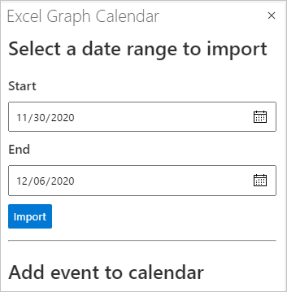

<!-- markdownlint-disable MD002 MD041 -->

Neste exercício, você incorporará o Microsoft Graph ao aplicativo. Para esse aplicativo, você usará a biblioteca [microsoft-graph-client](https://github.com/microsoftgraph/msgraph-sdk-javascript) para fazer chamadas para o Microsoft Graph.

## <a name="get-calendar-events-from-outlook"></a>Obtenha eventos de calendário do Outlook

Comece adicionando uma API para obter uma exibição [de](https://docs.microsoft.com/graph/api/user-list-calendarview) calendário do calendário do usuário.

1. Abra **./src/api/graph.ts** e adicione as instruções a seguir à `import` parte superior do arquivo.

    ```typescript
    import { zonedTimeToUtc } from 'date-fns-tz';
    import { findIana } from 'windows-iana';
    import * as graph from '@microsoft/microsoft-graph-client';
    import { Event, MailboxSettings } from 'microsoft-graph';
    import 'isomorphic-fetch';
    import { getTokenOnBehalfOf } from './auth';
    ```

1. Adicione a seguinte função para inicializar o SDK do Microsoft Graph e retornar um **Client**.

    :::code language="typescript" source="../demo/graph-tutorial/src/api/graph.ts" id="GetClientSnippet":::

1. Adicione a função a seguir para obter o fuso horário do usuário a partir de suas configurações de caixa de correio e para converter esse valor em um identificador de fuso horário IANA.

    :::code language="typescript" source="../demo/graph-tutorial/src/api/graph.ts" id="GetTimeZonesSnippet":::

1. Adicione a seguinte função (abaixo da `const graphRouter = Router();` linha) para implementar um ponto de extremidade da API ( `GET /graph/calendarview` ).

    :::code language="typescript" source="../demo/graph-tutorial/src/api/graph.ts" id="GetCalendarViewSnippet":::

    Considere o que esse código faz.

    - Ele obtém o fuso horário do usuário e usa isso para converter o início e o fim do exibição de calendário solicitado em valores UTC.
    - Ele faz um `GET` ao ponto de extremidade da API do `/me/calendarview` Graph.
        - Ele usa a função para definir o header, fazendo com que os horários de início e término dos eventos retornados sejam ajustados ao fuso `header` `Prefer: outlook.timezone` horário do usuário.
        - Ele usa a `query` função para adicionar os `startDateTime` `endDateTime` parâmetros e, definindo o início e o final do exibição de calendário.
        - Ele usa a `select` função para solicitar apenas os campos usados pelo complemento.
        - Ele usa a `orderby` função para classificar os resultados pela hora de início.
        - Ele usa a `top` função para limitar os resultados em uma única solicitação a 25.
    - Ele usa um **objeto PageIteratorCallback** para [iterar](https://docs.microsoft.com/graph/sdks/paging) pelos resultados e fazer solicitações adicionais se mais páginas de resultados estão disponíveis.

## <a name="update-the-ui"></a>Atualizar a interface do usuário

Agora vamos atualizar o painel de tarefas para permitir que o usuário especifique uma data inicial e final para o exibição de calendário.

1. Abra **./src/addin/taskpane.js** e substitua a função `showMainUi` existente pelo seguinte.

    :::code language="javascript" source="../demo/graph-tutorial/src/addin/taskpane.js" id="MainUiSnippet":::

    Este código adiciona um formulário simples para que o usuário possa especificar uma data de início e término. Ele também implementa um segundo formulário para criar um novo evento. Esse formulário não faz nada por enquanto, você implementará esse recurso na próxima seção.

1. Adicione o código a seguir ao arquivo para criar uma tabela na planilha ativa que contém os eventos recuperados do exibição de calendário.

    :::code language="javascript" source="../demo/graph-tutorial/src/addin/taskpane.js" id="WriteToSheetSnippet":::

1. Adicione a seguinte função para chamar a API de exibição de calendário.

    :::code language="javascript" source="../demo/graph-tutorial/src/addin/taskpane.js" id="GetCalendarSnippet":::

1. Salve todas as alterações, reinicie o servidor e atualize o painel de tarefas no Excel (feche todos os painéis de tarefas abertos e reaberto).

    

1. Escolha datas de início e término e escolha **Importar**.

    
