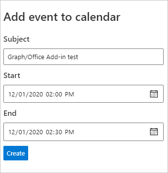

<!-- markdownlint-disable MD002 MD041 -->

Nesta seção, você adicionará a capacidade de criar eventos no calendário do usuário.In this section you will add the ability to create events on the user's calendar.

## Implementar a APIImplement the API

1. Abra **./src/api/graph.ts** e adicione o seguinte código para implementar uma nova API de evento ( `POST /graph/newevent` ).Open **./src/api/graph.ts** and add the following code to implement a new event API (`POST /graph/newevent`).

    :::code language="typescript" source="../demo/graph-tutorial/src/api/graph.ts" id="CreateEventSnippet":::

1. Abra **./src/addin/taskpane.js** e adicione a função a seguir para chamar a nova API de evento.Open **./src/addin/taskpane.js** and add the following function to call the new event API.

    :::code language="javascript" source="../demo/graph-tutorial/src/addin/taskpane.js" id="CreateEventSnippet":::

1. Salve todas as suas alterações, reinicie o servidor e atualize o painel de tarefas no Excel (feche todos os painéis de tarefas abertos e reaberto).Save all of your changes, restart the server, and refresh the task pane in Excel (close any open task panes and re-open).

    

1. Preencha o formulário e escolha **Criar**.Fill in the form and choose **Create**. Verifique se o evento foi adicionado ao calendário do usuário.Verify that the event is added to the user's calendar.
